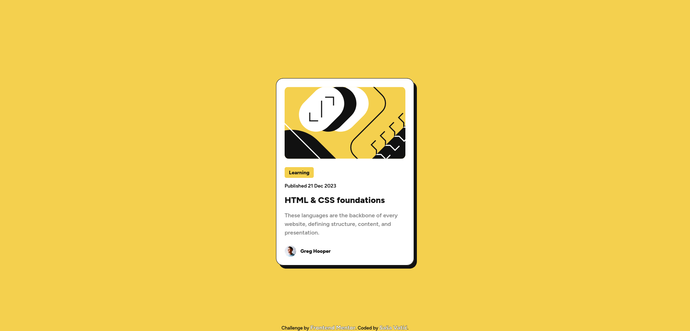

# Frontend Mentor - Blog preview card solution

This is a solution to the [Blog preview card challenge on Frontend Mentor](https://www.frontendmentor.io/challenges/blog-preview-card-ckPaj01IcS). Frontend Mentor challenges help you improve your coding skills by building realistic projects.

## Table of contents

- [The challenge](#the-challenge)
- [Screenshot](#screenshot)
- [Links](#links)
- [Author](#author)

### The challenge

Users should be able to:

- See hover and focus states for all interactive elements on the page

### Screenshot

### Links

- Solution URL: [https://www.frontendmentor.io/solutions/html-css-Sb7oHXzJEp](https://www.frontendmentor.io/solutions/html-css-Sb7oHXzJEp)
- Live Site URL: [https://sasavatic.github.io/blog-preview-card/](https://sasavatic.github.io/blog-preview-card/)

## Author

- Website - [Saša Vatić](https://sasavatic.netlify.app/)
- Frontend Mentor - [@SasaVatic](https://www.frontendmentor.io/profile/SasaVatic)
